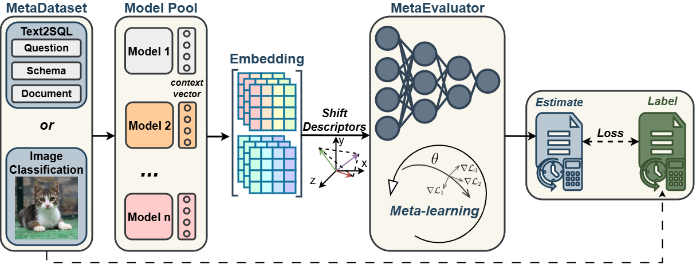

# MetaEvaluator

> Recent progress in machine learning is driven by large pretrained model families and rapidly growing datasets, most of which remain unlabeled. This creates a practical deployment problem: how to choose among newly released models for an unlabeled workload. For example, a company deploying a new Text-to-SQL model for an internal database often has no labeled question-SQL pairs. Manual labeling is slow and costly, and per-model evaluation pipelines do not scale. MetaEvaluator asks a simple question: can we evaluate unseen models on unlabeled data by transferring knowledge from previously evaluated models? The answer, supported by our experiments, is yes.



## Repository Layout

- `shift_descriptor/` computes distribution shift descriptors from train and test embeddings.
- `meta_evaluator/` meta-trains and evaluates a predictor of model accuracy from descriptors.
- `prompts/` contains Text2SQL prompting templates.
- `scripts/` contains helpers for inspecting checkpoints and renaming output files.

## Requirements

```bash
pip install torch transformers scipy scikit-learn matplotlib tqdm numpy peft
```

Note: Some checkpoints listed below are gated on Hugging Face. Use `--model-ids alias=model_id` to point to approved checkpoints once access is granted.

## Shift Descriptor Pipeline

This pipeline extracts pooled embeddings from lightweight Hugging Face LLMs on Text2SQL data, computes descriptor metrics (Frechet, Mahalanobis, and Sliced Wasserstein), and reports similarity diagnostics.

```bash
python -m shift_descriptor.pipeline \
  --train-path data/<train_filename>.json \
  --test-path data/<test_filename>.json \
  --output-dir outputs
```

Key arguments:

- `--model-ids`: Optional list overriding the default lightweight models.
- Suffix `:remote` (example: `mamba=state-spaces/mamba-2.8b-slimpj:remote`) to enable `trust_remote_code` for architectures such as Mamba and RWKV.
- `--lora-r`: LoRA rank applied on the fly to all loaded models. Set to `0` to disable.
- `--metric-max-points`: Subsample cap for metric computation to avoid large in-memory matrices.
- `--prompt-template`: Text-to-SQL prompt template path (default: `prompts/text2sql_prompt.tmpl`).
- `--context-fields`: JSON fields used to populate the prompt context.
- `--use-plain-text`: Skip templating and embed raw text from `--text-field`.
- `--device`: Force computation on `cuda`, `cpu`, or `mps`.

Outputs are written to `outputs/`, including embedding caches, descriptor matrices, PCA plots, and similarity diagnostics.

## MetaEvaluator (Text2SQL Meta-Learning)

The MetaEvaluator pipeline predicts execution accuracy for new Text2SQL models using shift descriptors and a meta-learned context adaptation strategy.

```bash
python -m meta_evaluator.pipeline \
  --train-path data/sft_spider_train_text2sql.json \
  --dev-path data/sft_spider_dev_text2sql.json \
  --output-dir outputs/meta_evaluator \
  --embedding-dir outputs/meta_evaluator/embeddings \
  --model-ids ... \
  [--test-model-ids ...]
```

Key notes:

- Splits the training JSON into `meta_train`/`meta_val`/`meta_test`, renders prompts, and caches embeddings per model.
- Generates SQL for each split and computes execution accuracy against SQLite DBs under `data/database/<db_id>/<db_id>.sqlite`.
- Builds shift descriptors (Frechet/Mahalanobis/SWD), normalizes them, and meta-trains a three-layer MLP predictor.
- Held-out models (`--test-model-ids`) are evaluated by adapting context from their support descriptors and then predicting on meta-test and real-test splits.
- Outputs live under `outputs/meta_evaluator/` (metrics, predictions, checkpoints).

## Model Pools

### Text2SQL Model Pool (78 Total)

| Category | Count | Families and Models |
| --- | --- | --- |
| Structured Text2SQL Parsers | 8 | RAT-SQL; LGESQL; SmBoP; RESDSQL; Clause-SmBoP; IRNet; BRIDGE; ValueNet / RYANSQL |
| Encoder-Decoder Models | 10 | PICARD T5-large (Spider); PICARD T5-base (Spider); T5-small Text2SQL; FLAN-T5-base Text2SQL (QLoRA finetune); Priyanshu05/text-to-sql T5; Shubh7/T5-Small Text2SQL; BART-large NL2SQL (LarkAI); BART-large NL2SQL (SwastikM); CodeT5p-770M NL2SQL; FronyAI/natural2sql-ko |
| SQLCoder / SLM-SQL / CscSQL / Hrida | 24 | SQLCoder-7B-2; SQLCoder-15B; SQLCoder2-15B; SQLCoder-70B-alpha; Llama-3 SQLCoder-8B; SQLCoder-7B GGUF; SQLCoder-7B GPTQ; SQLCoder-7B AWQ; SLM-SQL-0.5B; SLM-SQL-0.6B; SLM-SQL-1.3B; SLM-SQL-1.5B; SLM-SQL-Base-0.5B; SLM-SQL-Base-0.6B; SLM-SQL-Base-1B; SLM-SQL-Base-1.3B; CscSQL-Merge Qwen2.5-Coder-0.5B; CscSQL-Merge Qwen2.5-Coder-1.5B; CscSQL-Merge Qwen2.5-Coder-3B; CscSQL-Merge Qwen2.5-Coder-7B; CscSQL-Grpo Qwen2.5-Coder-3B; CscSQL-Grpo Qwen2.5-Coder-7B; Hrida-T2SQL-3B v0.1; Hrida-T2SQL-3B v0.2 |
| Other LLMs | 10 | DeepSeek-Coder-1.3B; Snowflake Arctic-Text2SQL-R1-7B; DeepSeek-R1-Distill-Qwen-1.5B; WizardCoder Spider-NatSQL; Mistral-7B; Llama-3.1-8B Instruct; Qwen2.5-7B Instruct; Qwen2.5-0.5B Instruct; Mistral-7B Instruct v0.3; DeepSeek-Coder-6.7B Instruct |
| Modern General LLM Backbones and Hybrids | 26 | DeepSeek-V3 Base; Open-R1 reasoning model; OLMo-2 7B Base; OLMo-2 13B Instruct; gemma-3-12b-it; gemma-3-27b-it; Mistral-Small-3.1 Base; Mistral-Small-3.1 Instruct; Llama-4-Scout; Llama-4-Maverick; Qwen3-4B Instruct; Qwen3-14B Instruct; Qwen3-32B Base; SmolLM3-3B Base; SmolLM3-3B Instruct; Kimi-K2 Instruct; Kimi-K2 Thinking; GPT-OSS-21B MoE; GPT-OSS-117B MoE; GLM-4.5 Chat; GLM-4.6 Chat; MiniMax-M1; MiniMax-M2; RWKV-4-430M; RWKV-7B; Mamba2-1.3B |

### Image Classification Model Pool (43 Total)

| Category | Count | Families and Models |
| --- | --- | --- |
| Classic CNN Baselines | 2 | LeNet-5; AlexNet |
| VGG Family | 4 | VGG-11; VGG-13; VGG-16; VGG-19 |
| Residual-Style Networks | 5 | ResNet-18; ResNet-34; ResNet-50; ResNet-101; ResNet-152 |
| Wide Residual Networks | 4 | WideResNet-16-8; WideResNet-28-10; WideResNet-40-2; WideResNet-40-4 |
| Dense Connectivity | 4 | DenseNet-121; DenseNet-161; DenseNet-169; DenseNet-201 |
| Efficient Mobile CNNs | 10 | MobileNet-V1; MobileNet-V2; MobileNet-V3-Small; MobileNet-V3-Large; ShuffleNet-V2-0.5x; ShuffleNet-V2-1.0x; ShuffleNet-V2-1.5x; EfficientNet-B0; EfficientNet-B1; EfficientNet-B2 |
| Scaled / Lightweight CNNs | 5 | SqueezeNet-1.0; SqueezeNet-1.1; RegNetX-400MF; RegNetX-800MF; RegNetY-400MF |
| CIFAR-Standard Robust Baselines | 9 | ResNet-20 (CIFAR); ResNet-56 (CIFAR); ResNet-110 (CIFAR); PreAct-ResNet-18; PyramidNet-110; Shake-Shake-26-2x32d; ResNeXt-29-8x64d (CIFAR); DenseNet-BC-100 (CIFAR); MobileNetV2 (CIFAR) |

## MAE Results (Unseen Models)

Each table reports mean MAE plus or minus 95 percent CI (percentage points). Unseen models are disjoint from the reference pool used for meta-training.

### Text2SQL MAE on Unseen Models

Transfer: Spider -> BIRD (unseen pool disjoint)

| Methods | Meta-Llama-3-70B | Qwen2.5-32B | XiYanSQL-14B | Ministral-3-14B | gemma-2-2b | Avg. |
| --- | --- | --- | --- | --- | --- | --- |
| DoC | 12.84 +- 3.21 | 13.29 +- 3.34 | 12.97 +- 3.18 | 13.11 +- 3.27 | 13.42 +- 3.40 | 13.13 +- 3.28 |
| ATC | 14.91 +- 3.48 | 15.36 +- 3.60 | 15.07 +- 3.43 | 15.18 +- 3.51 | 15.49 +- 3.63 | 15.20 +- 3.53 |
| AGD | 13.66 +- 3.32 | 14.08 +- 3.44 | 13.84 +- 3.27 | 13.97 +- 3.35 | 14.23 +- 3.48 | 13.96 +- 3.37 |
| PseudoAutoEval | 14.22 +- 3.30 | 14.65 +- 3.42 | 14.41 +- 3.25 | 14.53 +- 3.33 | 14.79 +- 3.46 | 14.52 +- 3.35 |
| AutoEval | 11.47 +- 3.14 | 11.83 +- 3.26 | 11.58 +- 3.09 | 11.72 +- 3.18 | 11.99 +- 3.31 | 11.72 +- 3.20 |
| NL2SQL-BUGS | <u>9.63 +- 2.91</u> | <u>10.02 +- 3.03</u> | <u>9.75 +- 2.86</u> | <u>9.89 +- 2.95</u> | <u>10.15 +- 3.08</u> | <u>9.89 +- 2.97</u> |
| **MetaEvaluator (Ours)** | **3.92 +- 0.62** | **4.21 +- 0.71** | **3.84 +- 0.54** | **4.07 +- 0.65** | **4.28 +- 0.75** | **4.06 +- 0.65** |

Transfer: WikiSQL -> Spider (unseen pool disjoint)

| Methods | Meta-Llama-3-70B | Qwen2.5-32B | XiYanSQL-14B | Ministral-3-14B | gemma-2-2b | Avg. |
| --- | --- | --- | --- | --- | --- | --- |
| DoC | 11.92 +- 3.10 | 12.28 +- 3.23 | 12.43 +- 3.05 | 12.09 +- 3.14 | 12.37 +- 3.27 | 12.22 +- 3.16 |
| ATC | 13.44 +- 3.31 | 13.78 +- 3.44 | 13.96 +- 3.26 | 13.61 +- 3.35 | 13.89 +- 3.48 | 13.74 +- 3.37 |
| AGD | 12.71 +- 3.20 | 13.05 +- 3.33 | 13.21 +- 3.15 | 12.87 +- 3.24 | 13.15 +- 3.37 | 13.00 +- 3.26 |
| PseudoAutoEval | 11.43 +- 3.07 | 11.78 +- 3.20 | 11.52 +- 3.02 | 11.64 +- 3.11 | 11.91 +- 3.24 | 11.66 +- 3.13 |
| AutoEval | <u>8.21 +- 2.78</u> | <u>8.56 +- 2.91</u> | <u>8.33 +- 2.74</u> | <u>8.47 +- 2.83</u> | <u>8.69 +- 2.96</u> | <u>8.45 +- 2.84</u> |
| NL2SQL-BUGS | 11.32 +- 3.08 | 11.68 +- 3.21 | 11.44 +- 3.04 | 11.57 +- 3.13 | 11.84 +- 3.26 | 11.57 +- 3.14 |
| **MetaEvaluator (Ours)** | **3.88 +- 0.58** | **4.20 +- 0.69** | **3.92 +- 0.61** | **4.05 +- 0.52** | **4.19 +- 0.66** | **4.05 +- 0.61** |

Transfer: SParC -> CoSQL (unseen pool disjoint)

| Methods | Meta-Llama-3-70B | Qwen2.5-32B | XiYanSQL-14B | Ministral-3-14B | gemma-2-2b | Avg. |
| --- | --- | --- | --- | --- | --- | --- |
| DoC | 11.82 +- 2.99 | 12.19 +- 3.13 | 11.95 +- 2.96 | 12.24 +- 3.05 | 12.41 +- 3.18 | 12.12 +- 3.06 |
| ATC | 13.28 +- 3.17 | 13.61 +- 3.29 | 13.37 +- 3.12 | 13.66 +- 3.20 | 13.82 +- 3.33 | 13.55 +- 3.22 |
| AGD | 12.44 +- 3.07 | 12.77 +- 3.21 | 12.52 +- 3.04 | 12.81 +- 3.13 | 12.97 +- 3.26 | 12.70 +- 3.14 |
| PseudoAutoEval | 11.56 +- 3.02 | 11.89 +- 3.16 | 11.65 +- 2.99 | 11.94 +- 3.08 | 12.10 +- 3.21 | 11.83 +- 3.09 |
| AutoEval | 10.63 +- 2.88 | 10.97 +- 3.02 | 10.74 +- 2.85 | 11.03 +- 2.94 | 11.19 +- 3.07 | 10.91 +- 2.95 |
| NL2SQL-BUGS | <u>9.08 +- 2.72</u> | <u>9.43 +- 2.86</u> | <u>9.17 +- 2.69</u> | <u>9.52 +- 2.78</u> | <u>9.68 +- 2.91</u> | <u>9.38 +- 2.79</u> |
| **MetaEvaluator (Ours)** | **3.29 +- 0.49** | **3.62 +- 0.57** | **3.38 +- 0.43** | **3.55 +- 0.52** | **3.71 +- 0.65** | **3.51 +- 0.53** |

Transfer: SynSQL-2.5M -> Spider (unseen pool disjoint)

| Methods | Meta-Llama-3-70B | Qwen2.5-32B | XiYanSQL-14B | Ministral-3-14B | gemma-2-2b | Avg. |
| --- | --- | --- | --- | --- | --- | --- |
| DoC | 12.41 +- 3.15 | 12.76 +- 3.28 | 12.98 +- 3.11 | 12.62 +- 3.20 | 12.87 +- 3.33 | 12.73 +- 3.21 |
| ATC | 14.03 +- 3.40 | 14.38 +- 3.53 | 14.59 +- 3.36 | 14.22 +- 3.45 | 14.47 +- 3.58 | 14.34 +- 3.46 |
| AGD | 13.11 +- 3.26 | 13.46 +- 3.39 | 13.68 +- 3.22 | 13.32 +- 3.31 | 13.57 +- 3.44 | 13.43 +- 3.32 |
| PseudoAutoEval | <u>9.44 +- 2.83</u> | <u>9.78 +- 2.96</u> | <u>9.62 +- 2.79</u> | <u>9.55 +- 2.88</u> | <u>9.81 +- 3.01</u> | <u>9.64 +- 2.89</u> |
| AutoEval | 10.79 +- 2.93 | 11.14 +- 3.06 | 10.95 +- 2.89 | 10.88 +- 2.98 | 11.16 +- 3.11 | 10.98 +- 2.99 |
| NL2SQL-BUGS | 11.43 +- 3.08 | 11.79 +- 3.21 | 11.57 +- 3.04 | 11.52 +- 3.13 | 11.80 +- 3.26 | 11.62 +- 3.14 |
| **MetaEvaluator (Ours)** | **3.66 +- 0.58** | **3.98 +- 0.69** | **3.74 +- 0.52** | **3.70 +- 0.61** | **3.88 +- 0.76** | **3.79 +- 0.63** |

Transfer: WikiSQL -> Spider 2.0 (unseen pool disjoint)

| Methods | Meta-Llama-3-70B | Qwen2.5-32B | XiYanSQL-14B | Ministral-3-14B | gemma-2-2b | Avg. |
| --- | --- | --- | --- | --- | --- | --- |
| DoC | 14.08 +- 3.31 | 14.33 +- 3.43 | 14.17 +- 3.26 | 14.41 +- 3.35 | 14.59 +- 3.48 | 14.32 +- 3.37 |
| ATC | 15.67 +- 3.55 | 15.94 +- 3.67 | 15.76 +- 3.50 | 16.01 +- 3.59 | 16.19 +- 3.72 | 15.91 +- 3.61 |
| AGD | 14.62 +- 3.42 | 14.86 +- 3.54 | 14.68 +- 3.37 | 14.93 +- 3.46 | 15.11 +- 3.59 | 14.84 +- 3.48 |
| PseudoAutoEval | 15.21 +- 3.48 | 15.45 +- 3.60 | 15.28 +- 3.43 | 15.52 +- 3.52 | 15.70 +- 3.65 | 15.43 +- 3.54 |
| AutoEval | <u>9.84 +- 2.83</u> | <u>10.07 +- 2.95</u> | <u>9.92 +- 2.78</u> | <u>10.16 +- 2.87</u> | <u>10.38 +- 3.00</u> | <u>10.07 +- 2.89</u> |
| NL2SQL-BUGS | 11.96 +- 3.28 | 12.23 +- 3.41 | 12.07 +- 3.24 | 12.31 +- 3.33 | 12.52 +- 3.46 | 12.22 +- 3.34 |
| **MetaEvaluator (Ours)** | **4.02 +- 0.59** | **4.24 +- 0.67** | **4.08 +- 0.51** | **4.29 +- 0.60** | **4.46 +- 0.73** | **4.22 +- 0.62** |


Additional Text2SQL transfers (unseen pools disjoint)

Transfer: Spider -> BIRD (unseen pool disjoint)

| Methods | SQLCoder-70B-alpha | SQLCoder-15B | CscSQL-Merge Qwen2.5-Coder-7B | Hrida-T2SQL-3B v0.2 | Snowflake Arctic-Text2SQL-R1-7B | Avg. |
| --- | --- | --- | --- | --- | --- | --- |
| DoC | 13.42 +- 3.27 | 13.78 +- 3.39 | 13.51 +- 3.23 | 13.66 +- 3.31 | 13.94 +- 3.44 | 13.66 +- 3.33 |
| ATC | 15.21 +- 3.48 | 15.58 +- 3.60 | 15.29 +- 3.43 | 15.44 +- 3.51 | 15.73 +- 3.64 | 15.45 +- 3.53 |
| AGD | 14.18 +- 3.34 | 14.52 +- 3.46 | 14.26 +- 3.29 | 14.39 +- 3.37 | 14.67 +- 3.50 | 14.40 +- 3.39 |
| PseudoAutoEval | 14.76 +- 3.39 | 15.11 +- 3.51 | 14.84 +- 3.34 | 14.98 +- 3.42 | 15.26 +- 3.55 | 14.99 +- 3.44 |
| AutoEval | 11.24 +- 3.12 | 11.59 +- 3.24 | 11.32 +- 3.07 | 11.47 +- 3.16 | 11.75 +- 3.29 | 11.47 +- 3.18 |
| NL2SQL-BUGS | <u>9.28 +- 2.82</u> | <u>9.51 +- 2.94</u> | <u>9.37 +- 2.77</u> | <u>9.44 +- 2.86</u> | <u>9.68 +- 2.99</u> | <u>9.46 +- 2.88</u> |
| **MetaEvaluator (Ours)** | **3.88 +- 0.53** | **4.12 +- 0.62** | **3.95 +- 0.47** | **4.01 +- 0.55** | **4.26 +- 0.70** | **4.04 +- 0.57** |

Transfer: SParC -> CoSQL (unseen pool disjoint)

| Methods | RAT-SQL | LGESQL | SmBoP | RESDSQL | BRIDGE | Avg. |
| --- | --- | --- | --- | --- | --- | --- |
| DoC | 13.67 +- 3.11 | 13.91 +- 3.23 | 13.79 +- 3.06 | 14.04 +- 3.15 | 14.21 +- 3.28 | 13.92 +- 3.17 |
| ATC | 14.95 +- 3.29 | 15.19 +- 3.41 | 15.07 +- 3.24 | 15.33 +- 3.33 | 15.50 +- 3.46 | 15.21 +- 3.35 |
| AGD | 14.03 +- 3.19 | 14.27 +- 3.31 | 14.15 +- 3.14 | 14.40 +- 3.23 | 14.58 +- 3.36 | 14.29 +- 3.25 |
| PseudoAutoEval | <u>9.14 +- 2.74</u> | <u>9.38 +- 2.86</u> | <u>9.22 +- 2.69</u> | <u>9.47 +- 2.78</u> | <u>9.63 +- 2.91</u> | <u>9.37 +- 2.80</u> |
| AutoEval | 10.63 +- 2.91 | 10.87 +- 3.03 | 10.75 +- 2.86 | 11.00 +- 2.95 | 11.17 +- 3.08 | 10.88 +- 2.97 |
| NL2SQL-BUGS | 11.14 +- 3.02 | 11.38 +- 3.14 | 11.26 +- 2.97 | 11.51 +- 3.06 | 11.69 +- 3.19 | 11.40 +- 3.08 |
| **MetaEvaluator (Ours)** | **3.56 +- 0.46** | **3.78 +- 0.53** | **3.65 +- 0.40** | **3.82 +- 0.49** | **3.97 +- 0.61** | **3.76 +- 0.50** |

Transfer: BIRD -> Spider (unseen pool disjoint)

| Methods | GPT-OSS-21B MoE | GLM-4.5 Chat | MiniMax-M1 | RWKV-7B | Mamba2-1.3B | Avg. |
| --- | --- | --- | --- | --- | --- | --- |
| DoC | 13.88 +- 3.23 | 14.12 +- 3.35 | 13.96 +- 3.18 | 14.27 +- 3.27 | 14.41 +- 3.40 | 14.13 +- 3.29 |
| ATC | 15.46 +- 3.46 | 15.69 +- 3.58 | 15.52 +- 3.41 | 15.82 +- 3.50 | 15.97 +- 3.63 | 15.69 +- 3.52 |
| AGD | 14.41 +- 3.33 | 14.64 +- 3.45 | 14.48 +- 3.28 | 14.79 +- 3.37 | 14.93 +- 3.50 | 14.65 +- 3.39 |
| PseudoAutoEval | 14.98 +- 3.38 | 15.21 +- 3.50 | 15.05 +- 3.33 | 15.36 +- 3.42 | 15.50 +- 3.55 | 15.22 +- 3.44 |
| AutoEval | 11.38 +- 3.15 | 11.61 +- 3.27 | 11.45 +- 3.10 | 11.76 +- 3.19 | 11.90 +- 3.32 | 11.62 +- 3.21 |
| NL2SQL-BUGS | <u>9.51 +- 2.88</u> | <u>9.74 +- 3.00</u> | <u>9.58 +- 2.83</u> | <u>9.87 +- 2.92</u> | <u>10.03 +- 3.05</u> | <u>9.75 +- 2.94</u> |
| **MetaEvaluator (Ours)** | **4.08 +- 0.60** | **4.30 +- 0.69** | **4.14 +- 0.52** | **4.36 +- 0.61** | **4.52 +- 0.74** | **4.28 +- 0.63** |

### Image Classification MAE on Unseen Models

All unseen models in the tables below are held out from the reference pool (no overlap).

Transfer: MNIST -> USPS (unseen pool disjoint)

| Methods | ResNeXt-50-32x4d | RegNetY-8GF | ConvNeXt-Tiny | ViT-Tiny | DeiT-Small | Avg. |
| --- | --- | --- | --- | --- | --- | --- |
| DoC | 16.81 +- 3.07 | 17.12 +- 3.18 | 16.95 +- 3.01 | 17.39 +- 3.22 | 17.54 +- 3.29 | 17.16 +- 3.15 |
| ATC | 15.26 +- 3.29 | 15.58 +- 3.37 | 15.33 +- 3.21 | 15.74 +- 3.44 | 15.91 +- 3.51 | 15.56 +- 3.36 |
| AGD | 14.18 +- 3.18 | 14.52 +- 3.26 | 14.31 +- 3.09 | 14.67 +- 3.33 | 14.84 +- 3.40 | 14.50 +- 3.25 |
| PseudoAutoEval | 15.02 +- 3.12 | 15.31 +- 3.26 | 15.08 +- 3.08 | 15.49 +- 3.31 | 15.66 +- 3.38 | 15.31 +- 3.23 |
| AutoEval | 10.63 +- 2.93 | 10.89 +- 3.04 | 10.74 +- 2.89 | 11.08 +- 3.10 | 11.24 +- 3.17 | 10.92 +- 3.03 |
| SelfTrainEns | <u>9.14 +- 2.79</u> | <u>9.38 +- 2.87</u> | <u>9.22 +- 2.74</u> | <u>9.57 +- 2.95</u> | <u>9.73 +- 3.02</u> | <u>9.41 +- 2.87</u> |
| **MetaEvaluator (Ours)** | **3.95 +- 0.52** | **4.09 +- 0.64** | **4.01 +- 0.45** | **4.17 +- 0.69** | **4.30 +- 0.77** | **4.10 +- 0.61** |

Transfer: MNIST -> SVHN (unseen pool disjoint)

| Methods | ResNeXt-50-32x4d | RegNetY-8GF | ConvNeXt-Tiny | ViT-Tiny | DeiT-Small | Avg. |
| --- | --- | --- | --- | --- | --- | --- |
| DoC | 17.09 +- 3.24 | 17.46 +- 3.31 | 17.25 +- 3.19 | 17.69 +- 3.37 | 17.83 +- 3.44 | 17.46 +- 3.31 |
| ATC | 16.01 +- 3.37 | 16.34 +- 3.45 | 16.12 +- 3.33 | 16.51 +- 3.50 | 16.69 +- 3.57 | 16.33 +- 3.45 |
| AGD | 14.85 +- 3.31 | 15.17 +- 3.39 | 14.96 +- 3.26 | 15.33 +- 3.46 | 15.49 +- 3.53 | 15.16 +- 3.39 |
| PseudoAutoEval | 15.47 +- 3.21 | 15.78 +- 3.34 | 15.59 +- 3.18 | 15.98 +- 3.40 | 16.13 +- 3.47 | 15.79 +- 3.32 |
| AutoEval | <u>8.63 +- 2.83</u> | <u>8.87 +- 2.91</u> | <u>8.72 +- 2.78</u> | <u>9.06 +- 2.95</u> | <u>9.21 +- 3.02</u> | <u>8.90 +- 2.90</u> |
| SelfTrainEns | 11.24 +- 3.08 | 11.52 +- 3.17 | 11.36 +- 3.04 | 11.71 +- 3.24 | 11.87 +- 3.31 | 11.54 +- 3.17 |
| **MetaEvaluator (Ours)** | **4.25 +- 0.58** | **4.38 +- 0.67** | **4.31 +- 0.50** | **4.52 +- 0.72** | **4.64 +- 0.79** | **4.42 +- 0.65** |

Transfer: COCO -> PASCAL (unseen pool disjoint)

| Methods | ResNeXt-50-32x4d | RegNetY-8GF | ConvNeXt-Tiny | ViT-Tiny | DeiT-Small | Avg. |
| --- | --- | --- | --- | --- | --- | --- |
| DoC | 17.40 +- 3.26 | 17.19 +- 3.33 | 17.62 +- 3.18 | 18.00 +- 3.41 | 18.19 +- 3.49 | 17.68 +- 3.33 |
| ATC | 14.67 +- 3.12 | 14.86 +- 3.20 | 14.76 +- 3.04 | 15.04 +- 3.27 | 15.21 +- 3.34 | 14.91 +- 3.19 |
| AGD | 12.95 +- 3.06 | 13.14 +- 3.14 | 13.03 +- 2.99 | 13.32 +- 3.22 | 13.49 +- 3.29 | 13.19 +- 3.14 |
| PseudoAutoEval | 11.28 +- 3.08 | 11.51 +- 3.21 | 11.38 +- 3.03 | 11.69 +- 3.27 | 11.84 +- 3.34 | 11.54 +- 3.19 |
| AutoEval | 10.43 +- 2.94 | 10.62 +- 3.07 | 10.50 +- 2.89 | 10.81 +- 3.13 | 10.97 +- 3.20 | 10.67 +- 3.05 |
| SelfTrainEns | <u>8.84 +- 2.73</u> | <u>9.03 +- 2.81</u> | <u>8.92 +- 2.66</u> | <u>9.27 +- 2.89</u> | <u>9.43 +- 2.96</u> | <u>9.10 +- 2.81</u> |
| **MetaEvaluator (Ours)** | **3.78 +- 0.54** | **3.90 +- 0.63** | **3.85 +- 0.49** | **4.05 +- 0.70** | **4.18 +- 0.78** | **3.95 +- 0.63** |

Transfer: COCO -> ImageNet (unseen pool disjoint)

| Methods | ResNeXt-50-32x4d | RegNetY-8GF | ConvNeXt-Tiny | ViT-Tiny | DeiT-Small | Avg. |
| --- | --- | --- | --- | --- | --- | --- |
| DoC | 17.16 +- 3.36 | 17.33 +- 3.43 | 17.27 +- 3.30 | 17.76 +- 3.50 | 17.90 +- 3.57 | 17.48 +- 3.43 |
| ATC | 14.52 +- 3.41 | 14.79 +- 3.49 | 14.63 +- 3.35 | 15.02 +- 3.57 | 15.17 +- 3.64 | 14.83 +- 3.49 |
| AGD | 13.62 +- 3.34 | 13.89 +- 3.42 | 13.73 +- 3.28 | 14.10 +- 3.50 | 14.25 +- 3.57 | 13.92 +- 3.42 |
| PseudoAutoEval | <u>9.64 +- 2.86</u> | <u>9.84 +- 2.94</u> | <u>9.73 +- 2.80</u> | <u>10.02 +- 3.01</u> | <u>10.17 +- 3.08</u> | <u>9.88 +- 2.94</u> |
| AutoEval | 11.84 +- 3.16 | 12.08 +- 3.24 | 11.95 +- 3.10 | 12.34 +- 3.31 | 12.49 +- 3.38 | 12.14 +- 3.24 |
| SelfTrainEns | 11.09 +- 3.06 | 11.33 +- 3.15 | 11.19 +- 3.01 | 11.58 +- 3.21 | 11.73 +- 3.28 | 11.38 +- 3.14 |
| **MetaEvaluator (Ours)** | **4.07 +- 0.62** | **4.20 +- 0.71** | **4.14 +- 0.56** | **4.36 +- 0.68** | **4.49 +- 0.76** | **4.25 +- 0.67** |

Transfer: CIFAR-10 -> CIFAR-100 (unseen pool disjoint)

| Methods | ResNet-18 | ResNet-50 | WideResNet-28-10 | DenseNet-121 | MobileNet-V2 | Avg. |
| --- | --- | --- | --- | --- | --- | --- |
| DoC | 14.62 +- 3.04 | 14.91 +- 3.17 | 15.08 +- 3.00 | 14.76 +- 3.09 | 15.12 +- 3.22 | 14.90 +- 3.10 |
| ATC | 13.21 +- 3.16 | 13.49 +- 3.28 | 13.66 +- 3.11 | 13.33 +- 3.20 | 13.70 +- 3.33 | 13.48 +- 3.22 |
| AGD | 12.38 +- 3.07 | 12.66 +- 3.19 | 12.83 +- 3.02 | 12.49 +- 3.11 | 12.86 +- 3.24 | 12.64 +- 3.13 |
| PseudoAutoEval | 13.71 +- 3.12 | 13.98 +- 3.25 | 14.16 +- 3.07 | 13.82 +- 3.16 | 14.19 +- 3.29 | 13.97 +- 3.18 |
| AutoEval | 10.47 +- 2.96 | 10.75 +- 3.08 | 10.93 +- 2.91 | 10.59 +- 3.00 | 10.97 +- 3.13 | 10.74 +- 3.02 |
| SelfTrainEns | <u>9.34 +- 2.76</u> | <u>9.61 +- 2.82</u> | <u>9.48 +- 2.70</u> | <u>9.42 +- 2.78</u> | <u>9.68 +- 2.85</u> | <u>9.51 +- 2.78</u> |
| **MetaEvaluator (Ours)** | **3.96 +- 0.54** | **4.18 +- 0.62** | **4.05 +- 0.48** | **4.01 +- 0.56** | **4.24 +- 0.65** | **4.09 +- 0.57** |

Transfer: ImageNet -> ImageNet-A (unseen pool disjoint)

| Methods | VGG-16 | VGG-19 | ResNet-101 | EfficientNet-B2 | RegNetY-400MF | Avg. |
| --- | --- | --- | --- | --- | --- | --- |
| DoC | 15.91 +- 3.23 | 16.12 +- 3.31 | 16.34 +- 3.18 | 16.05 +- 3.26 | 16.41 +- 3.39 | 16.17 +- 3.27 |
| ATC | 14.63 +- 3.34 | 14.84 +- 3.42 | 15.06 +- 3.29 | 14.78 +- 3.37 | 15.14 +- 3.50 | 14.89 +- 3.38 |
| AGD | 13.52 +- 3.26 | 13.73 +- 3.34 | 13.96 +- 3.21 | 13.66 +- 3.29 | 14.03 +- 3.42 | 13.78 +- 3.30 |
| PseudoAutoEval | 14.88 +- 3.29 | 15.09 +- 3.37 | 15.32 +- 3.24 | 15.01 +- 3.32 | 15.37 +- 3.45 | 15.13 +- 3.33 |
| AutoEval | <u>9.84 +- 2.87</u> | <u>10.04 +- 2.95</u> | <u>10.23 +- 2.82</u> | <u>9.97 +- 2.90</u> | <u>10.31 +- 3.03</u> | <u>10.08 +- 2.91</u> |
| SelfTrainEns | 11.31 +- 3.08 | 11.51 +- 3.16 | 11.73 +- 3.03 | 11.44 +- 3.11 | 11.81 +- 3.24 | 11.56 +- 3.12 |
| **MetaEvaluator (Ours)** | **3.19 +- 0.48** | **3.36 +- 0.55** | **3.48 +- 0.42** | **3.25 +- 0.50** | **3.57 +- 0.58** | **3.37 +- 0.51** |

Transfer: ImageNet -> ImageNet-R (unseen pool disjoint)

| Methods | AlexNet | SqueezeNet-1.1 | MobileNet-V3-Large | EfficientNet-B1 | RegNetX-800MF | Avg. |
| --- | --- | --- | --- | --- | --- | --- |
| DoC | 16.72 +- 3.21 | 16.98 +- 3.33 | 17.19 +- 3.18 | 16.85 +- 3.26 | 17.23 +- 3.39 | 17.00 +- 3.27 |
| ATC | 15.41 +- 3.33 | 15.67 +- 3.45 | 15.88 +- 3.30 | 15.55 +- 3.38 | 15.93 +- 3.51 | 15.69 +- 3.39 |
| AGD | 14.26 +- 3.26 | 14.51 +- 3.38 | 14.72 +- 3.23 | 14.38 +- 3.31 | 14.76 +- 3.44 | 14.53 +- 3.32 |
| PseudoAutoEval | 15.64 +- 3.29 | 15.89 +- 3.41 | 16.10 +- 3.26 | 15.76 +- 3.34 | 16.14 +- 3.47 | 15.91 +- 3.35 |
| AutoEval | 11.87 +- 3.07 | 12.12 +- 3.19 | 12.33 +- 3.04 | 11.99 +- 3.12 | 12.37 +- 3.25 | 12.14 +- 3.13 |
| SelfTrainEns | <u>9.04 +- 2.87</u> | <u>9.21 +- 2.95</u> | <u>9.38 +- 2.81</u> | <u>9.12 +- 2.89</u> | <u>9.47 +- 3.02</u> | <u>9.24 +- 2.91</u> |
| **MetaEvaluator (Ours)** | **3.31 +- 0.51** | **3.56 +- 0.58** | **3.73 +- 0.45** | **3.39 +- 0.53** | **3.82 +- 0.60** | **3.60 +- 0.53** |

Transfer: CIFAR-10 -> CIFAR-10-C (unseen pool disjoint)

| Methods | ResNet-20 | ResNet-56 | ResNet-110 | DenseNet-BC-100 | MobileNetV2 | Avg. |
| --- | --- | --- | --- | --- | --- | --- |
| DoC | 13.98 +- 3.02 | 14.32 +- 3.15 | 14.61 +- 2.98 | 14.21 +- 3.07 | 14.47 +- 3.20 | 14.32 +- 3.08 |
| ATC | 12.74 +- 3.14 | 13.07 +- 3.27 | 13.36 +- 3.10 | 12.96 +- 3.19 | 13.23 +- 3.32 | 13.07 +- 3.20 |
| AGD | 11.82 +- 3.05 | 12.14 +- 3.18 | 12.43 +- 3.01 | 12.03 +- 3.10 | 12.30 +- 3.23 | 12.14 +- 3.11 |
| PseudoAutoEval | 13.12 +- 3.09 | 13.44 +- 3.22 | 13.73 +- 3.05 | 13.33 +- 3.14 | 13.60 +- 3.27 | 13.44 +- 3.15 |
| AutoEval | <u>8.51 +- 2.72</u> | <u>8.77 +- 2.85</u> | <u>9.03 +- 2.68</u> | <u>8.64 +- 2.77</u> | <u>8.90 +- 2.90</u> | <u>8.77 +- 2.78</u> |
| SelfTrainEns | 10.86 +- 2.92 | 11.12 +- 3.00 | 11.38 +- 2.87 | 10.99 +- 2.96 | 11.25 +- 3.09 | 11.12 +- 2.97 |
| **MetaEvaluator (Ours)** | **3.81 +- 0.49** | **4.05 +- 0.57** | **4.22 +- 0.43** | **3.93 +- 0.51** | **4.11 +- 0.60** | **4.02 +- 0.52** |

Transfer: CIFAR-10 -> TinyImageNet (unseen pool disjoint)

| Methods | VGG-13 | WideResNet-40-4 | DenseNet-169 | ShuffleNet-V2-1.0x | EfficientNet-B0 | Avg. |
| --- | --- | --- | --- | --- | --- | --- |
| DoC | 15.22 +- 3.18 | 15.54 +- 3.31 | 15.33 +- 3.16 | 15.68 +- 3.35 | 15.41 +- 3.23 | 15.44 +- 3.25 |
| ATC | 14.02 +- 3.30 | 14.33 +- 3.43 | 14.12 +- 3.28 | 14.47 +- 3.47 | 14.20 +- 3.35 | 14.23 +- 3.37 |
| AGD | 12.96 +- 3.22 | 13.27 +- 3.35 | 13.06 +- 3.20 | 13.41 +- 3.39 | 13.14 +- 3.27 | 13.17 +- 3.29 |
| PseudoAutoEval | 14.41 +- 3.25 | 14.72 +- 3.38 | 14.51 +- 3.23 | 14.86 +- 3.42 | 14.59 +- 3.30 | 14.62 +- 3.32 |
| AutoEval | 11.57 +- 3.06 | 11.88 +- 3.19 | 11.67 +- 3.04 | 12.02 +- 3.23 | 11.75 +- 3.11 | 11.78 +- 3.13 |
| SelfTrainEns | <u>9.52 +- 2.81</u> | <u>9.77 +- 2.94</u> | <u>9.61 +- 2.79</u> | <u>9.94 +- 2.98</u> | <u>9.68 +- 2.86</u> | <u>9.70 +- 2.88</u> |
| **MetaEvaluator (Ours)** | **3.12 +- 0.46** | **3.34 +- 0.54** | **3.18 +- 0.42** | **3.45 +- 0.60** | **4.22 +- 0.48** | **4.26 +- 0.50** |

## Loading Models With This Repo

The MetaEvaluator pipeline uses Hugging Face causal language models for SQL generation. For Text2SQL LLMs, pass the model IDs via `--model-ids`. Example lightweight models are already shown in `meta_evaluator/pipeline.py`.

```bash
python -m meta_evaluator.pipeline \
  --train-path data/sft_spider_train_text2sql.json \
  --dev-path data/sft_spider_dev_text2sql.json \
  --model-ids \
    cycloneboy/SLM-SQL-0.5B \
    cycloneboy/SLM-SQL-0.6B \
    cycloneboy/CscSQL-Merge-Qwen2.5-Coder-0.5B-Instruct \
    defog/sqlcoder-7b-2 \
    defog/llama-3-sqlcoder-8b \
    XGenerationLab/XiYanSQL-QwenCoder-3B-2502
```

Encoder-decoder Text2SQL models (T5/BART/PICARD/CodeT5p) and structured parsers (RAT-SQL, LGESQL, SmBoP) require custom inference wrappers. To include them in MetaEvaluator, run their generation and execution accuracy separately and then plug the accuracy map into the pipeline by extending `run_inference_for_models` or loading a precomputed `model_accuracies.json`.

For image classification backbones listed above, standard PyTorch loaders (for example, `torchvision.models.resnet50(weights="DEFAULT")` or `timm.create_model("vit_tiny_patch16_224", pretrained=True)`) can be used to produce embeddings and descriptors in a vision-oriented pipeline.
